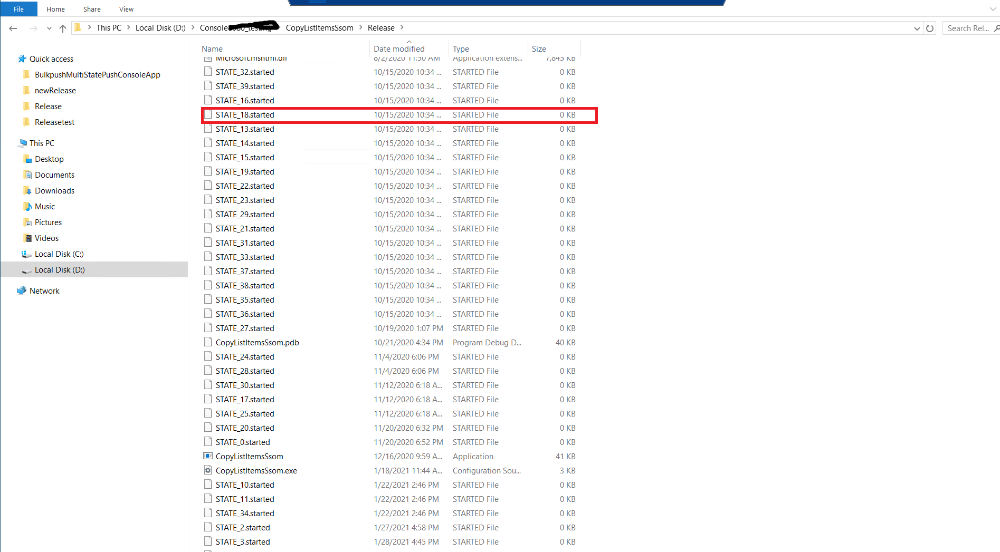
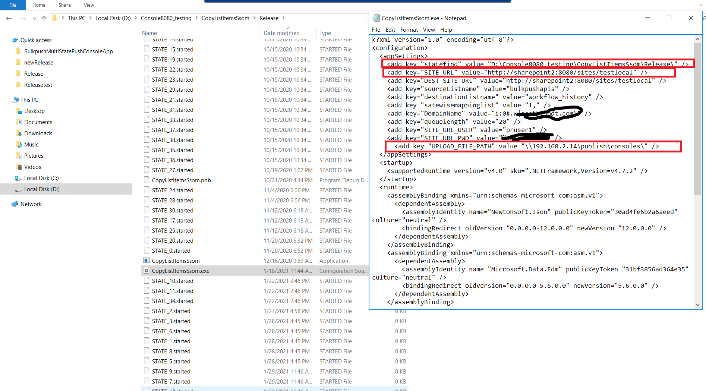
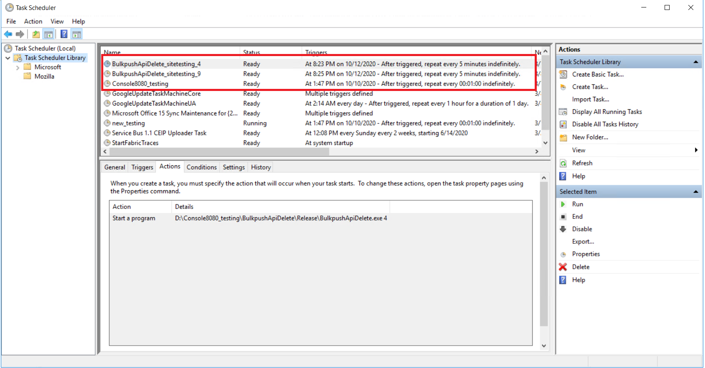
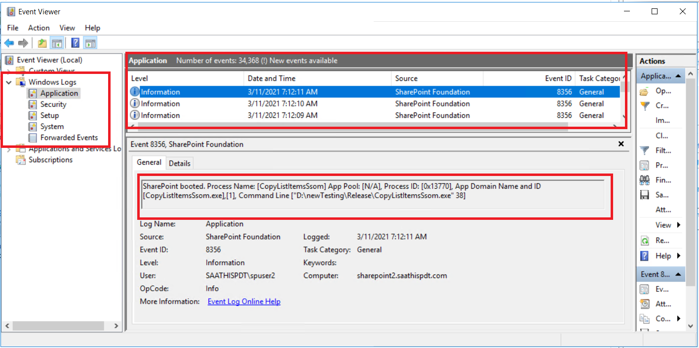

PIP Sharepoint Troubleshoot steps

step 1 :

1.1 Login to sharepoint server 
1.2 open respective console app location as [D:\Console**\CopyListItemsSsom\Release]
1.3 Refer below image and hilighted file name should not be in folder end with state id  

step 2 :

2.1 Using below refer image 1 open the highlited path as configured 
2.2 Enter into the folders name 'normal' and verfiy Today date json file ends with requested StateID
2.3 If 2.2 step related stateid file not shown plz contact UI team or administrator.

step 3 :

3.1 If step2 works fine verify the windows hilighted task sheduler in running condition or not  
3.2 Hightlited task sheduler not working start sheule imediatly 
3.3 and recheck the step 1 if any state ID file is shown in folder

step 4 :

4.1 Open the windows evernt viewer If any applications or system errors occures contact to system administrator 
    refer the below image 

step 5 :

5.1 Open the windows IIS server and verify all Application pools are starting or not, If not contact to system administrator 
    refer the below image 

step 5 :

5.1 Open the windows IIS server and verify all Application pools are starting or not, If not contact to system administrator 
    refer the below image 

    
    
    
    
    
    
    
    
    
